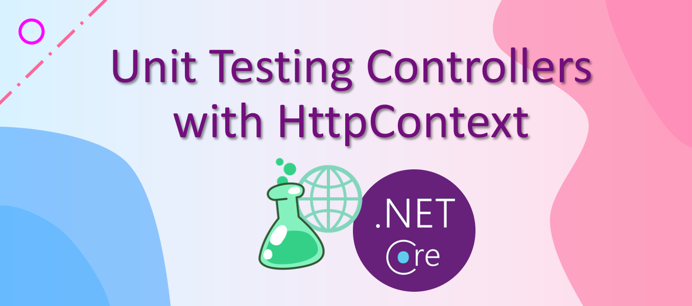

# Controller Unit Tests

[](https://ko-fi.com/I3I63W4OK)



We do different levels of testings against controllers. When unit testing controller logic, the test only executes a single action method without going through the framework's request/response pipeline. In other words, the filter attributes (e.g., the `Authorize` attribute ), model binding, and middlewares do not affect unit tests for controllers. Thus, unit testing controller logic is quite similar to testing a regular class where we can mock dependencies and stage input values and verify outputs.

One thing is different is that a controller has an implicit dependency, `ControllerContext`, inherited from `ControllerBase`. The `ControllerContext` includes the frequently used `HttpContext`, `ModelState`, and other features.

In this article, we will go over some use cases when unit testing an action method that involves HttpContext. For example, an action method checks the current user's role based on `ClaimIdentity`, an action method checks HttpRequest header values. We will see how to stage HttpContext and Request. Following a similar fashion, we should also know how to stage Response and ModelState in unit tests.

## Claims

Claims are usually being used to inspect permissions and/or differentiate results. For example, in an action method, we can first get a user's role using `User.FindFirstValue(ClaimTypes.Role)`, then determine the next step based on the role's permission level.

When unit testing an action method, we want to check the behaviors for different user roles. In this case, we can configure the controller's ControllerContext and set the HttpContext with a desired user. Let's take a look at the following test.

```csharp
var user = new ClaimsPrincipal(new ClaimsIdentity(new[] {
    new Claim(ClaimTypes.NameIdentifier, "11234568"),
    new Claim(ClaimTypes.Name, "admin last"),
    new Claim(ClaimTypes.Role, "Admin")
}));
var controller = new ValuesController(new NullLogger<ValuesController>())
{
    ControllerContext = { HttpContext = new DefaultHttpContext { User = user } }
};

var response = controller.Get();

Assert.IsInstanceOfType(response, typeof(OkObjectResult));
var result = ((OkObjectResult)response).Value as string[];
Assert.IsNotNull(result);
Assert.AreEqual(2, result.Length);
Assert.AreEqual("value1", result[0]);
Assert.AreEqual("value2", result[1]);
```

## Request Headers

Knowing how to hook up HttpContext to a controller, we can try something out about configuring Http Request.

Let's use a contrived action method as an example. The logic in this action method is based on the language in Request Headers, where the language value can be obtained by using `var lang = Request.Headers["lang"].ToString();`. In order to stage a request header key-value pairs, we can first attach an HttpContext to the controller, then set up the desired request header.

```csharp
var controller = new ValuesController(new NullLogger<ValuesController>())
{
    ControllerContext = new ControllerContext { HttpContext = new DefaultHttpContext() }
};
controller.Request.Headers["lang"] = language;

var response = controller.GetValueById(id);

Assert.IsInstanceOfType(response, typeof(OkObjectResult));
```

## ModelState

Similarly, we can manipulate ModelState based on our needs.

```csharp
var controller = new ValuesController(new NullLogger<ValuesController>());
controller.ModelState.Clear();
controller.ModelState.AddModelError("test", "test");
```

## License

Feel free to use the code in this repository as it is under MIT license.

[](https://ko-fi.com/I3I63W4OK)
